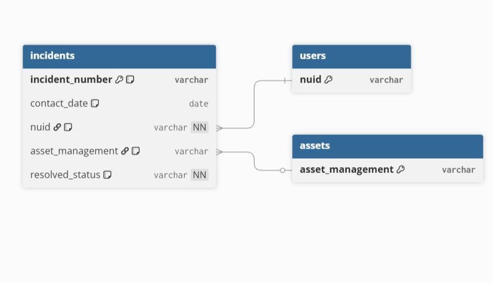

# ServiceNow Ticket Analysis (2023)

## Overview
This project analyzes a synthetic ServiceNow-style incident dataset representing
virtual support activity during calendar year 2023. The purpose of the analysis is
to demonstrate practical SQL skills applied to real-world IT service management and
operational reporting scenarios.

The analysis focuses on establishing baseline workload metrics and evaluating overall
resolution effectiveness before pursuing deeper segmentation or trend analysis.

All data used in this project is fictional and created solely for portfolio
demonstration purposes.

---

## Business Context
In virtual support environments, understanding normal ticket volume and resolution
performance is essential for effective staffing, backlog management, and process
improvement. Without clear baselines, it becomes difficult to distinguish between
normal variation and meaningful operational issues.

This analysis mirrors the type of exploratory reporting commonly performed by
operations, reporting, and IT service management analysts to support internal
decision-making.

---

## Dataset Description
The project uses three related tables modeled after a typical ServiceNow schema:

- **Incidents**  
  Individual support tickets, including contact date, resolution status, user
  identifier (NUID), and optional asset association.

- **Users**  
  Synthetic user identifiers representing repeat requesters across multiple incidents.

- **Assets**  
  Synthetic asset identifiers representing managed devices or systems linked to
  incidents when applicable.

The dataset reflects a standard Monday–Friday support schedule with realistic
incident volume and resolution patterns.

---
## Entity Relationship Diagram (ERD)

The diagram below illustrates the relationships between incidents, users, and assets
in the ServiceNow-style dataset.

---

## Key Questions Addressed
This initial phase of analysis focuses on two foundational questions:

1. **What does normal daily incident volume look like?**  
   Establishes a baseline workload to contextualize future analysis.

2. **What percentage of incidents are resolved versus unresolved overall?**  
   Measures high-level operational effectiveness using a core ITSM KPI.

These questions are intentionally scoped to demonstrate analytical sequencing and
clarity rather than breadth.

---

## Tools & Approach
- **SQL**: Data aggregation and KPI analysis  
- **Hosted SQL Environment (data.world)**: Query execution and validation  
- **GitHub**: Version control, documentation, and portfolio presentation  
- **Excel**: Dataset generation and validation  

Queries are written to prioritize clarity, portability, and alignment with
real-world analytics workflows rather than platform-specific optimizations.

---

## Project Structure
